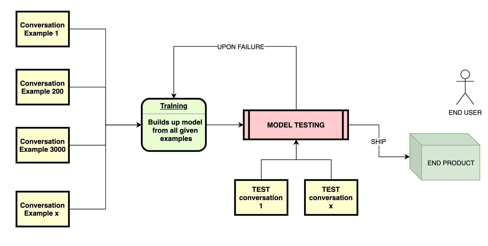
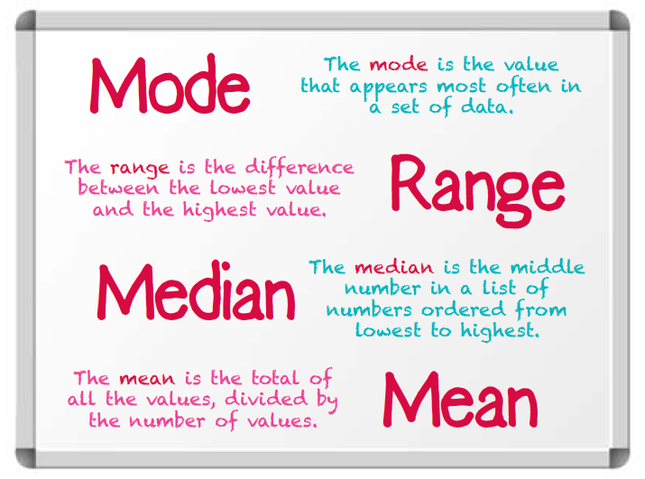
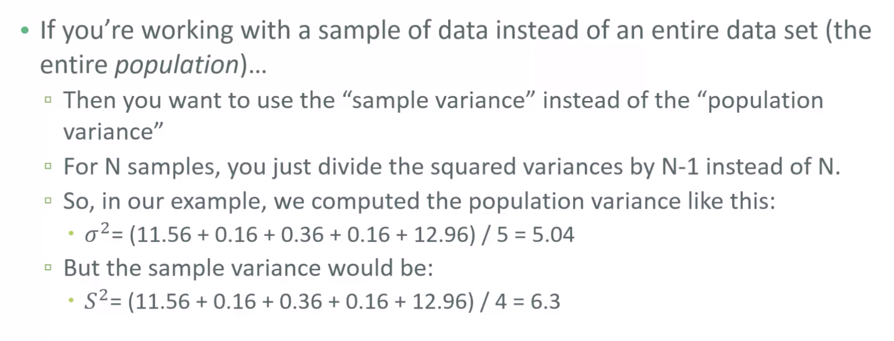

# MCMURCHIE'S ML WORKSHOP


# LEARNING OUTCOMES

0. [PROJECTS](#PROJECTS)
1. [INTRODUCTION](#INTRODUCTION)
2. [BUILD YOUR FIRST NETWORK](#BUILD-YOUR-OWN-NEURAL-NETWORK)
3. [STATISTICS REFRESHER](#STATISTICS-REFRESHER)
4. [PANDAS SUMMARY](#PANDAS-SUMMARY)
5. [STATISTICS THEORY](#STATISTICS-THEORY )
6. [BASE REQUIREMENTS](#BASE-REQUIREMENTS)
7. [NEURAL NETS IN PYTORCH](PYTORCH/NN_SUMMARY/PYTORCH_NN_SUMMARY.ipynb)
  
  

# PROJECTS 

- [Kaggle_Titanic](https://github.com/murchie85/Kaggle_Titanic)
- [Bank_Exit_Modeling](https://github.com/murchie85/Bank_Exit_Modeling)  
- [银行顾客流失预测模型](https://github.com/murchie85/yinhang-lizhi-renyuan-yuce-moxing)  
- [TWITTER-REPORT-GENERATOR](https://github.com/murchie85/TWITTER-REPORT-GENERATOR)
- [IBA intelligent budgeting](https://github.com/murchie85/IBA)
- [brainmass predictrion](https://github.com/murchie85/Brain-prediction)

# INTRODUCTION

 
You will no doubt have heard the terms **A.I**, **Machine Learning**, **Deep Learning**, **Neural Networks** and so on - they are all related at some level. One of the key features that they all have in common, is unlike all other forms of programming, intelligence isn't architected into the system by a human, rather the system is **architected** *(by a human)* so it can become 'intelligent'.     

 What does this actually mean though? Imagine you are building a chatbot, traditionally you would have to consider all the scenarios a customer would interact with it, such as - greetings, answering a question, asking customer for more infomation etc. It might look something like this *(example sudo code only)*: 

```
when customer-logsin say hello:

if customer asks 'what time is it?':
	return (current time)

if customer asks 'can I open an account?':
    return (ask customer for their details)
```
  
Clearly this can become both complex and tedious what if the customer doesn't ask *'what time is it'* but *'can you tell me the time'* dealing with all the different ways someone might ask a question is hard enough. Now imagine trying to architect for all the scenarious in say a banking bot, or a customer service chatbot. To make matters worse, there is order of questions/answers to consider.
  
 
 What would the A.I/Machine learning equivalent look like?  



   

*Noting the above diagram* : rather than write code to cover every scenario we can conceive, we feed the code a large volume of sample conversations that customers have had with our staff *(when say opening an account)*. The more samples we give it, the more scenarios it will know how to respond to. Once the model has been trained on all the input conversations, we test it against other sample conversations *(that we kept aside)*, if the model doesn't perform and fails to answer all questions in the right way, then the model must undergo more training either adding more conversations or changing the way it trains. If the model passes the tests then we can package and ship the model for deployment ready for end users.   

You are probably thinking **WTF** and have many questions - how does the model train? How does the tests know which are successful? All in good time :)  

 The one thing I want you to focus on above for now, is what happens when the model fails - as this is the key underlying commonality and fundamental function that almost all neural networks and machine learning algorythms have in common. Let's look at another picture ... keep the above one in the back of your mind for comparison.    

<p align="center">
  
</p>


 What you are looking at above, is called a Back propogating neural network, like the other diagram you can see it feeds back onto itself. Without delving too deep into the mechanics, what is happening here is at the end of the process (the output) is making a guess based on what was fed in *(the sample conversations)* the system compares how the conversation should have gone (frome our test example) versus the guess. Whatever the difference/error is, is then fed back into the system as a 'learning' and it tries again. Usually this happens 10s of thousands of times up to billions depending on the network, computing power etc.  

 Essentially what I want to convey is, every loop around the circuit results in a smaller error. This is how the system learns. By comparing expected versus actual, then using the difference to steer the system in the right direction


# BUILD YOUR OWN NEURAL NETWORK 

Ok hopefully the above made some level of sense, what we are going to do here is jump right into the deep end *(it’s not that bad)* - and build our own Neural Network. Remember the key feature of this is backward propagation, it will go round many cycles improving itself.
  

<p align="center">
  
</p>


Without further ado, jump to my [blog](https://murchie85.github.io/NeuralNetwork.html) where you can simply just paste the code and run it on your computer. Or (which I strongly suggest) read the blog as well, as it explains each bit of the code. 

Link [here](https://murchie85.github.io/NeuralNetwork.html).   
Or watch me do it on [youtube](https://www.youtube.com/watch?v=NqzU4XSOLVk)


# STATISTICS REFRESHER 



# PANDAS SUMMARY 

pandas is an open source, easy-to-use data structures and data analysis tools for the Python programming. In order to run advanced ML code, we need to prepare, sort and clean data first - Pandas is the best for this. Below is just an overview of key commands. 

## SIMPLE EXAMPLE 

Run the below sample in python, so you can see how easy it is to create a table, it may look daunting but all that is happening is on line 1, we are importing the pandas library, line 2 is we are making up values of the table and passing into the variable 'raw_data'. The third command we create the dataframe (df) which is the key feature of pandas and the final line 'df' just prints it out. For more, try out this [tutorial](https://chrisalbon.com/python/data_wrangling/pandas_dataframe_examples/). 

```
import pandas as pd

raw_data = {'first_name': ['Jason', 'Molly', 'Tina', 'Jake', 'Amy'], 
        'last_name': ['Miller', 'Jacobson', 'Ali', 'Milner', 'Cooze'], 
        'age': [42, 52, 36, 24, 73], 
        'preTestScore': [4, 24, 31, 2, 3],
        'postTestScore': [25, 94, 57, 62, 70]}
df = pd.DataFrame(raw_data, columns = ['first_name', 'last_name', 'age', 'preTestScore', 'postTestScore'])
df

```


## KEY PANDAS COMMANDS


| Function        | Command           | 
| ------------- |:-------------:| 
| get first      | `df.head()` | 
| get last      | `df.tail()`      |  
| get dimensions | `df.shape`       |  
|get full size |`df.size`|
|get columns list |`df.columns`  |
|extract target column|`df['my_target_column`  |
|sort table by given column  |`df.sort_values(['my_target_column` |
|get value count|`df['Level of Education'].value_counts`|


## PANDAS TO GRAPH

```
PANDAST_TABLE.plot(kind='bar')
```

# CREATE A RANDOM POPULATED MATRIX

```
import numpy as np
ages = np.random.randint(18, high=90, size=500) # from 18 to 90
print(ages)
```

```
[85 19 27 63 19 87 54 87 18 76 80 58 88 61 82 66 23 71 61 51 72 81 20 79
 58 64 53 60 42 23 20 33 65 53 67 25 65 47 50 40 49 42 30 70 57 43 77 88
 60 58 32 83 87 22 67 32 61 82 61 88 80 74 48 50 33 29 41 78 30 35 25 74
 25 51 26 30 36 19 27 55 70 86 43 36 46 83 75 57 36 66 36 24 37 77 87 60
 28 36 75 58 19 32 38 52 55 78 34 65 78 56 79 39 86 71 53 39 20 72 74 19
 19 26 88 60 64 87 25 53 43 53 87 19 84 68 54 83 64 73 43 25 23 59 62 54
 20 59 23 59 75 68 25 79 26 33 27 60 30 56 71 40 23 66 73 77 71 28 43 27
 69 67 44 65 49 75 88 28 61 40 37 79 31 18 20 68 51 40 23 24 62 85 29 41
 66 53 21 46 53 46 24 19 62 28 50 74 26 26 30 34 70 23 73 31 55 86 47 40
 22 41 56 39 87 35 49 56 57 21 56 38 87 88 88 23 23 39 65 87 43 50 78 51
 83 33 67 20 80 56 60 39 71 83 26 47 46 34 40 28 79 27 88 49 30 82 53 83
 37 74 23 63 34 24 75 63 72 42 27 23 18 29 74 22 60 29 85 49 61 72 63 79
 78 41 85 86 63 34 31 81 65 60 42 22 62 83 45 19 79 39 49 37 41 31 34 38
 51 47 31 70 56 87 27 69 42 72 57 80 87 50 83 46 86 62 40 56 66 86 37 59
 79 81 74 58 20 84 64 29 27 22 45 73 66 23 43 21 47 59 50 22 57 64 21 38
 25 56 33 49 33 64 60 78 69 29 66 72 74 36 55 41 31 57 51 80 67 84 34 42
 24 89 53 47 22 80 73 44 68 65 24 64 51 36 63 26 34 38 38 70 39 82 36 75
 20 79 84 73 52 65 61 46 55 55 28 80 79 77 55 51 70 47 23 65 33 54 38 66
 65 41 23 52 82 41 64 81 74 59 28 29 33 70 83 32 29 24 27 73 41 57 50 23
 25 42 43 37 80 42 50 56 74 25 18 81 73 56 22 24 63 27 75 62 47 64 30 57
 37 36 59 81 69 19 87 37 89 47 88 65 77 80 74 38 57 89 58 78]
 ```

 # STATISTICS THEORY 
  
 ## HOW TO READ A HISTOGRAM

 
  

- 4 arrivals per minute happens about 13 times
- 12 arrivals pm about 1 or 2 
- So it is very UNLIKKELY to have 1 or 12 arrivals per minute


# POPULATION VS SAMPLE




<p align="center">
  
</p>


## CREATE YOUR OWN HISTOGRAM 

Look at the code below, the third command creates the values, 100 = centre point (mean), 20 = standard deviation, 10000 number of samples.  
  
  


Above example shows, that anything more than std deviation of 20 (120 / 80) drops of sharply. 
  

<p align="left">
  
</p>


# warning

- Try not to think of it as a probability of that value occuring 
- It's better to think of a probability that range of values will occur (i.e. in the bucket) 
- Particularily relevant to continuous data  

# IT IS DIFFERENT FOR DISCRETE DATA   


<p align="center">
  
</p>


- WE CAN PUT CONCRETE NUMBERS ON IT OCCURING 


## BASE REQUIREMENTS 


1. Install Python (Any Knowledge of Python strongly desirable)
2. Install Jupyter Notebooks 
3. Install the Below pip requirements (run `pip install xxxx` where xxxx is the name of module below)


scikit_learn  
numpy  
pandas  
statsmodels  
xlrd  
pydotplus  

