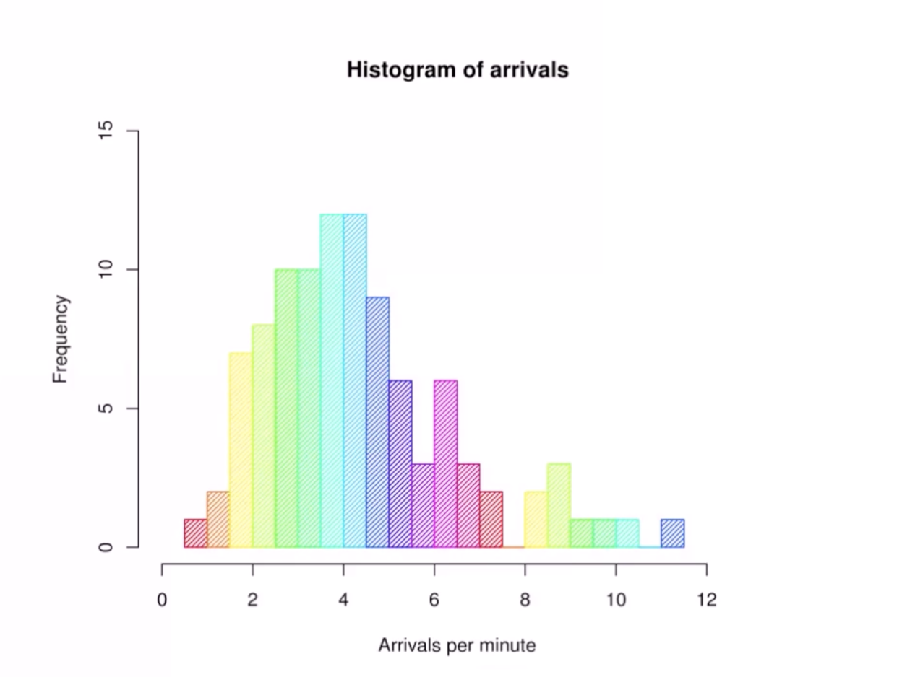
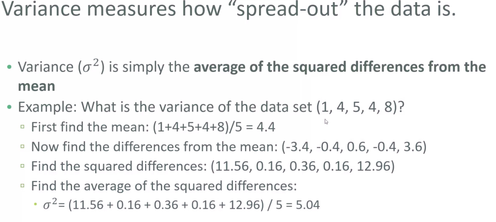
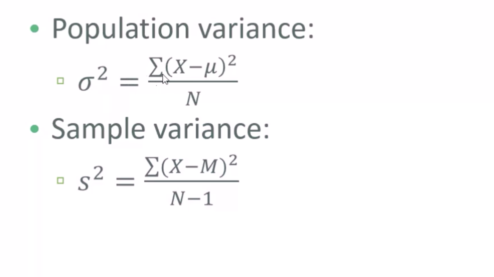
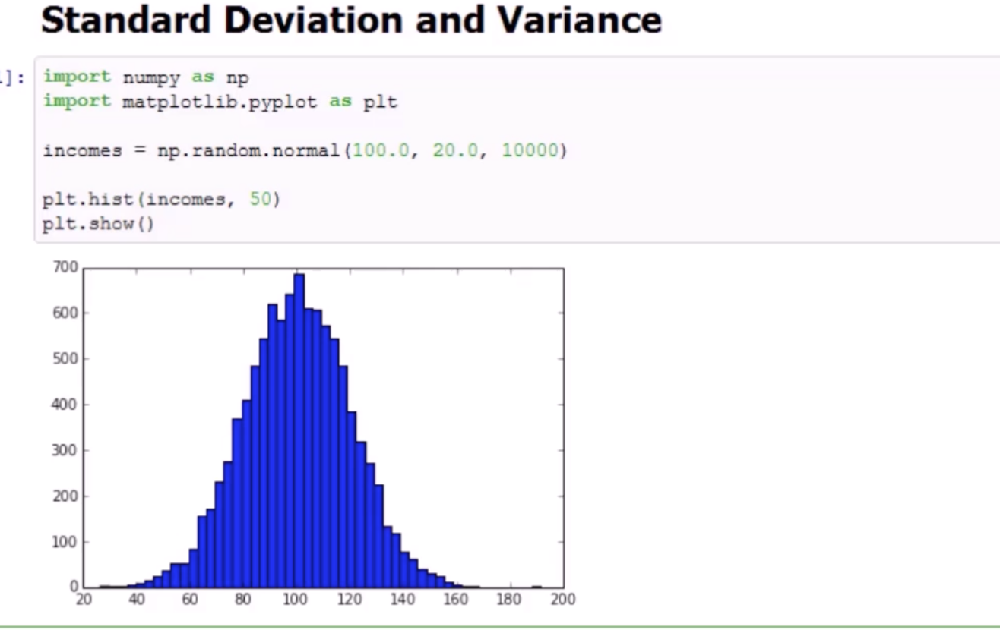
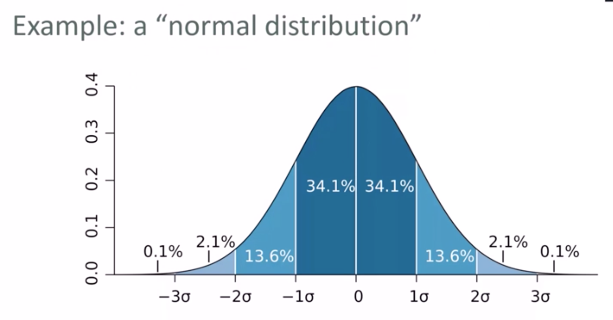
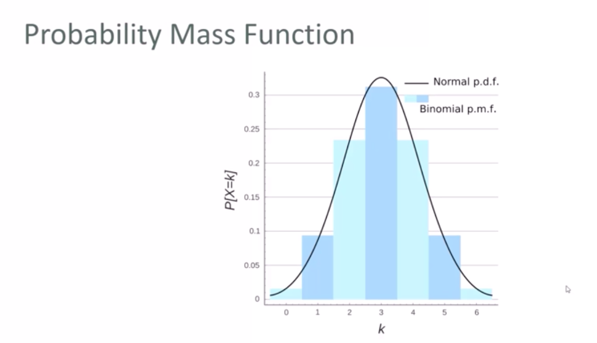

# MCMURCHIE'S ML WORKSHOP


## BASE REQUIREMENTS 

1. Knowledge of Python
2. Experience working with Jupyter notebooks
3. Below level pip requirements 


scikit_learn
numpy
pandas
statsmodels
xlrd
pydotplus


# STATISTICS BASICS REFRESHER 


# KEY PANDAS COMMANDS

### get first   
`df.head`
### get last   
`df.tail`     
### get dimensions   
`df.shape` 
### get full size 
`df.size`            
### get columns list  
`df.columns`             
### extract target column  
`df['my_target_column`         
### sort table by given column  
`df.sort_values(['my_target_column` 
### get value count
`df['Level of Education'].value_counts`


## PANDAS TO GRAPH

```
PANDAST_TABLE.plot(kind='bar')
```

# CREATE A RANDOM POPULATED MATRIX

```
import numpy as np
ages = np.random.randint(18, high=90, size=500) # from 18 to 90
print(ages)
```

```
[85 19 27 63 19 87 54 87 18 76 80 58 88 61 82 66 23 71 61 51 72 81 20 79
 58 64 53 60 42 23 20 33 65 53 67 25 65 47 50 40 49 42 30 70 57 43 77 88
 60 58 32 83 87 22 67 32 61 82 61 88 80 74 48 50 33 29 41 78 30 35 25 74
 25 51 26 30 36 19 27 55 70 86 43 36 46 83 75 57 36 66 36 24 37 77 87 60
 28 36 75 58 19 32 38 52 55 78 34 65 78 56 79 39 86 71 53 39 20 72 74 19
 19 26 88 60 64 87 25 53 43 53 87 19 84 68 54 83 64 73 43 25 23 59 62 54
 20 59 23 59 75 68 25 79 26 33 27 60 30 56 71 40 23 66 73 77 71 28 43 27
 69 67 44 65 49 75 88 28 61 40 37 79 31 18 20 68 51 40 23 24 62 85 29 41
 66 53 21 46 53 46 24 19 62 28 50 74 26 26 30 34 70 23 73 31 55 86 47 40
 22 41 56 39 87 35 49 56 57 21 56 38 87 88 88 23 23 39 65 87 43 50 78 51
 83 33 67 20 80 56 60 39 71 83 26 47 46 34 40 28 79 27 88 49 30 82 53 83
 37 74 23 63 34 24 75 63 72 42 27 23 18 29 74 22 60 29 85 49 61 72 63 79
 78 41 85 86 63 34 31 81 65 60 42 22 62 83 45 19 79 39 49 37 41 31 34 38
 51 47 31 70 56 87 27 69 42 72 57 80 87 50 83 46 86 62 40 56 66 86 37 59
 79 81 74 58 20 84 64 29 27 22 45 73 66 23 43 21 47 59 50 22 57 64 21 38
 25 56 33 49 33 64 60 78 69 29 66 72 74 36 55 41 31 57 51 80 67 84 34 42
 24 89 53 47 22 80 73 44 68 65 24 64 51 36 63 26 34 38 38 70 39 82 36 75
 20 79 84 73 52 65 61 46 55 55 28 80 79 77 55 51 70 47 23 65 33 54 38 66
 65 41 23 52 82 41 64 81 74 59 28 29 33 70 83 32 29 24 27 73 41 57 50 23
 25 42 43 37 80 42 50 56 74 25 18 81 73 56 22 24 63 27 75 62 47 64 30 57
 37 36 59 81 69 19 87 37 89 47 88 65 77 80 74 38 57 89 58 78]
 ```

 # HOW TO READ A HISTOGRAM

 
  

- 4 arrivals per minute happens about 13 times
- 12 arrivals pm about 1 or 2 
- So it is very UNLIKKELY to have 1 or 12 arrivals per minute




# POPULATION VS SAMPLE






Above example shows, that anything more than std deviation of 20 (120 / 80) drops of sharply. 
  

  

# warning

- Try not to think of it as a probability of that value occuring 
- It's better to think of a probability that range of values will occur (i.e. in the bucket) 
- Particularily relevant to continuous data  

# IT IS DIFFERENT FOR DISCRETE DATA   



- WE CAN PUT CONCRETE NUMBERS ON IT OCCURING 